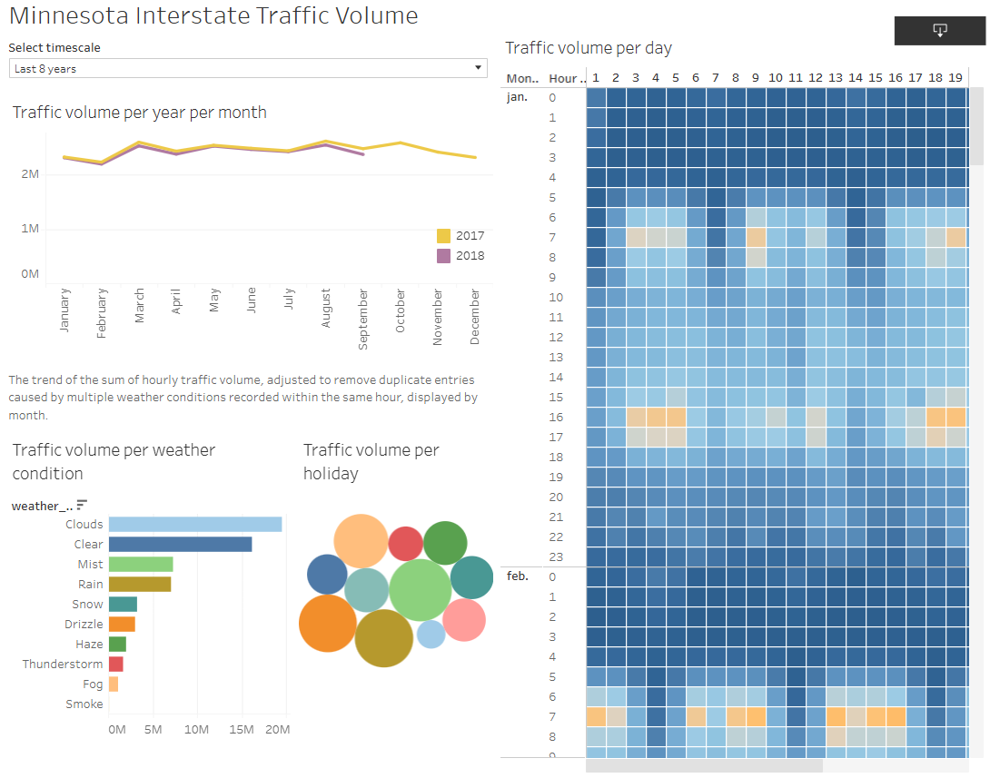
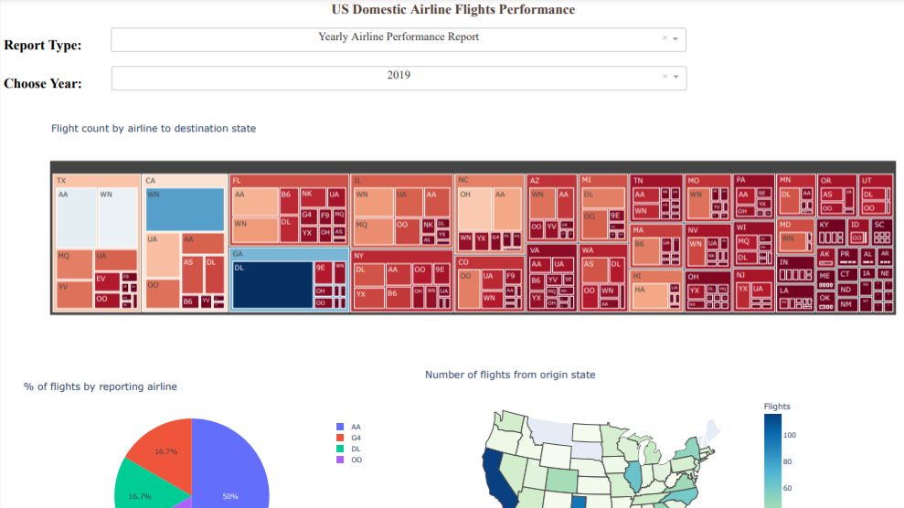

# Welcome to My Data Science and Analytics Portfolio
This professional portfolio showcases a diverse range of Data Science and Analytics projects that I have undertaken for academic purposes, personal development, and professional training. Here, you will find detailed case studies of my work, reflections on what I've learned, and documentation of my core competencies along with certifications that validate my expertise.

Feel free to contact me for collaboration or further discussion:
- **Email:** muratko357@gmail.com
- **LinkedIn:** [linkedin.com/in/muratko357](https://www.linkedin.com/in/muratko357/)

---

## Projects
 _To explore the associated documents, click on the title of each project._
 
...
 
### **[Aid Worker Security Incidents Dashboard (1997-2024)](https://github.com/muratko357/Aid-worker-security-incidents-analysis)**

_Tools: Power BI, DAX, M, Python, GeoPy, Pandas, QGIS, Mapshaper_

This Power BI project aims to analyze security incidents involving humanitarian aid workers, delivering actionable insights into incident patterns, victim demographics, and organizational involvement. Leveraging advanced data modeling, geospatial analysis, and interactive dashboards, the project empowers security managers and analysts in the humanitarian sector to make informed strategic and operational decisions.

 
 

 

<small style="color:gray; font-size: 0.7em;">_Data: Humanitarian Outcomes' Aid Worker Security Database (aidworkersecurity.org)_</small>
 
#### _Key Features:_

**Global and Regional Analysis:**
- Page 1: Global Overview (1997–2024) with heatmaps and aggregated victim counts.
- Page 2: East Mediterranean Humanitarian Corridor (2012–2024) with bubble and custom province-level maps.
  
**Advanced Data Modeling:**
- Multi-dimensional analysis enabled by bridge and dimension tables.
- Interactive slicers for organization, casualty type and victim’s organizations, and other dimensions.

**Geospatial Integration:**
- Custom maps created using QGIS and MapShaper.
- Shapefiles standardized and converted to TopoJSON for Power BI integration.

#### Tools & Technologies:
- Power BI for dynamic visualizations and DAX-based insights.
- Python for reverse geocoding and missing data imputation.
- GIS Tools (QGIS and MapShaper) for creating and merging custom maps.

#### Challenges & Innovations:
- Addressed geographic name inconsistencies across datasets.
- Integrated reverse geocoding to fill missing region and province names.
- Standardized shapefile projections and formats for seamless mapping.

**Impact:** This dashboard provides humanitarian organizations with actionable insights into security risks, supporting managers in resource allocation, risk assessment, and policy development. By integrating data cleaning, modeling, and GIS tools, it serves as a blueprint for advanced geospatial analysis and reporting.

_Note: The data points indicating incident locations are approximate rather than exact, due to the imputation of missing values in the latitude and longitude columns._

📂 Explore the [repository](https://github.com/muratko357/Aid-worker-security-incidents-analysis):

Check out the repository for Power Query M code, DAX measures, and Python scripts.

📊 Download the Dashboard:

A downloadable version of the Power BI file is accessible [here](https://github.com/muratko357/Aid-worker-security-incidents-analysis/blob/main/Dashboard%20aid%20worker%20security%2020241122.pbix).

...
 
### **[Rule of Law Dashboard: A Historical Comparison of Countries' Performances 1789-2023](Rule_of_Law_Dashboard-Compare_Countries_1789-2023.pbix)**

 

_Tools: Power BI, DAX_

This interactive Power BI dashboard leverages the V-Dem Dataset (Varieties of Democracy) and provides a comprehensive analysis of the Rule of Law Index and related indicators from 1789 to 2023, offering insights into governance standards across various nations, with a focus on EU members and candidate countries. In order to enrich the dataset, I added calculated columns for Geographic Regions, EU Candidates, and EU Membership Status based on historical data, allowing users to explore trends within specific regional contexts and EU expansion over time. Key features include:

**Historical Trends Analysis:** Visualizes the evolution of governance indicators, such as access to justice and judicial independence, enabling users to track trends over centuries. EU expansion is highlighted with dynamically updated information as users hover over specific years.

**Dynamic Indicator Calculations:** The dashboard employs advanced DAX formulas to allow users to select indicators and dynamically update the visualizations, providing indicator-specific insights tailored to user preferences.

**Country Comparisons:** Users can select individual countries or regions, such as Europe or EU candidates, to compare rule of law performance. A bar chart ranks countries based on their most recent scores, offering a quick visual comparison across selected nations.

**Country-Specific Ranking and Score Analysis:** On drill-through pages, users can view each selected country’s historical name, historical score, and ranking for each Rule of Law indicator by year, enabling detailed, year-over-year comparisons within a global context.

**Interactive Tooltips and Descriptions:** Tooltips and dynamic text boxes provide definitions and detailed explanations for each indicator, alongside contextual information from the dataset codebook and relevant academic references.

A downloadable version of the Power BI file is accessible [here](Rule_of_Law_Dashboard-Compare_Countries_1789-2023.pbix).

...

### **[Inventory Management Dashboard](inventory_management_dashboard.pbix)**

 

_Tools: Power BI, DAX_

This Inventory Management Dashboard enables data-driven decision making to enhance supply chain efficiency, showcasing advanced Power BI visualizations and DAX formulas. Key features include:

**ABC and XYZ Analysis:** The dashboard segments products by their revenue contribution (ABC classification) and demand consistency (XYZ classification), allowing businesses to focus on high-priority items with reliable or unpredictable demand patterns.

**Reorder Optimization:** Using dynamic calculations, the dashboard identifies when stock should be replenished based on historical sales data, lead times, and supplier delivery intervals. This helps maintain optimal stock levels, reducing both excess inventory and stockouts.

**Inventory Turnover Insights:** The Inventory Turnover Ratio helps monitor the frequency with which inventory is sold and replenished, providing critical data to improve stock movement and overall supply chain performance.

**Sales and Demand Trends:** By analyzing historical sales trends, the dashboard supports better forecasting and inventory planning, ensuring that stock levels are aligned with actual market demand. 

TA downloadable version of the Power BI file is accessible [here](inventory_management_dashboard.pbix).

...

### **[Minnesota Interstate Traffic Volume Analysis](https://public.tableau.com/views/GoogleBusinessIntelligenceCarrierCertificateMinnesotaTrafficVolume/Minnesota?:language=en-US&:sid=&:display_count=n&:origin=viz_share_link)**

 

_Tools: Google Cloud, Google DataFlow, Google BigQuery, Tableau_

As the capstone project for the Google Business Intelligence Professional Certificate, this analysis showcases my expertise in building BI solutions, data pipelines, and interactive visualizations. The project involved developing a detailed BI project plan, constructing a data pipeline via Google DataFlow to transport data to BigQuery, and creating a Tableau dashboard that visualizes Minnesota interstate traffic volume. The dashboard also explores the effects of weather, holidays, and time of day on traffic patterns, providing insights into the best times for road maintenance and construction. [View Dashboard](https://public.tableau.com/views/GoogleBusinessIntelligenceCarrierCertificateMinnesotaTrafficVolume/Minnesota?:language=en-US&:sid=&:display_count=n&:origin=viz_share_link)

...

### **[Creating a Dashboard with Python: Airline Flights Performance](https://github.com/muratko357/dash_application/blob/main/US_Domestic_Airline_Flights_Performance.py)** 

_Tools: Python, pandas, plotly, dash_

I developed an interactive web-based dashboard to analyze and visualize the real-time performance of US domestic airlines. Using Python's powerful libraries—pandas for data manipulation, Plotly for interactive charts, and Dash for the web framework—the application offers a comprehensive analysis of various performance metrics such as flight cancellations, average airtime, and delays across different categories. The dashboard allows users to filter data by year and report type, providing tailored insights into trends affecting airline operations.

...

### **[Weather Prediction](https://github.com/muratko357/Weather-prediction/blob/main/Weather%20prediction.ipynb)** 

 

_Tools: Python, numpy, pandas, matplotlib, seaborn, scipy, sklearn, time_

I built a machine-learning classification model to predict whether it will rain tomorrow using Australian weather data. I evaluated various models, including Logistic Regression, Decision Tree, Random Forest, and Support Vector Machine, to determine the best fit based on accuracy and computation time. 

...

 

### **[LendingClub Data Analysis: Predicting Payments](https://github.com/muratko357/ML_models/blob/master/Decision_Tree_and_Random-Forests_Project.ipynb)**

 

_Tools: Python, numpy, pandas, matplotlib, seaborn, sklearn_

I performed an exploratory data analysis on LendingClub loan data using data visualization techniques. Then, I applied Random Forest and Decision Tree models to predict loan repayment outcomes, considering variables such as loan purpose, interest rate, monthly installments, borrower income, debt-to-income ratio, FICO score, and credit line age.

...
 

### **[Bank Note Authentication](https://github.com/muratko357/ML_models/blob/master/banknote-authentication.ipynb)**

 

_Tools: Python, pandas, matplotlib, seaborn, sklearn, tensorflow_

Using the UCI Bank Authentication Data Set, I employed a Deep Neural Network Classifier to predict the authenticity of bank notes. The dataset includes features such as the variance, skewness, kurtosis, and entropy of Wavelet Transformed images.           

...
 

### **[Uber Data Analysis](https://github.com/muratko357/Uber-data-analysis)**

 

_Tools: Python, numpy, pandas, matplotlib, seaborn_

I analyzed Uber pickup data from April 2014 in New York using data visualization and crosstabulation techniques. The analysis provides insights for business and drivers based on the geographic location and timing of the calls.

...
 

### **[Analysis of the Dataset for California Electoral Politics](https://arcg.is/vOr9v)**

 

_Tools: ArcGIS_

I conducted an analysis of California’s 2012 electoral data, focusing on geographic information and vote counts related to the proposition on GMOs in food. Using this data, I created a map that visualizes the normalized distribution of 'yes' votes across each county. You can view the layout of the map in PDF format **[here](https://github.com/muratko357/muratko357.github.io/blob/main/Images/California%20electoral%20politics%202012.pdf)**, and access the full map package on my ArcGIS account **[here](https://arcg.is/vOr9v)**.

...
 

### **[San Francisco Crime Data Analysis](https://github.com/muratko357/San-Francisco-Crime-Data-Analysis)**

 
_Tools: Python, pandas, matplotlib, seaborn, folium_

I performed an exploratory data analysis on San Francisco's 2016 crime dataset using visualization tools, crosstabulation, and crime mapping to display crime rates across city districts.

...
 

### **[COVID-19 Group Project-Part II: Creating an Automatic Web-Scraping and Text Summarization Tool](https://github.com/muratko357/NLP_coronavirus_project)**

 
_Tools: Python, pandas, BeautifulSoup, nltk, re, threading, time_

For my Data Science & Machine Learning course, I created an automatic web-scraping and text summarization tool using Natural Language Processing (NLP). This tool collects and processes official COVID-19 reports and media summaries to help the public easily follow official advice and news.

..
 

### **[Art Generation with Neural Style Transfer](https://github.com/muratko357/Building_Convolutional_Neural_Networks/blob/master/Art_Generation_with_Neural_Style_Transfe.ipynb)**

 

_Tools: Python, numpy, pandas, os, sys, scipy, imageio, matplotlib, tersorflow, pprint_

I implemented the Neural Style Transfer (NST) algorithm to generate an artistic image of the Louvre museum in Paris in the style of a Claude Monet painting. The algorithm uses a pre-trained 19-layer VGG network model.

...
 

### **[Car Detection for Autonomous Driving Application](https://github.com/muratko357/Building_Convolutional_Neural_Networks/blob/master/Autonomous_driving_application_Car_detection.ipynb)**

 

_Tools: Python, numpy, argparse, os, matplotlib, scipy, PIL, tensorflow, keras, yolo utilities provided by deeplearning.ai_

I applied the You Only Look Once (YOLO) model for car detection using a pre-trained dataset. YOLO is known for its high accuracy and real-time processing capabilities.

...
 

### **[Face Verification & Face Recognition](https://github.com/muratko357/Building_Convolutional_Neural_Networks/blob/master/Face_Recognition.ipynb)**

 

_Tools: Python, numpy, pandas, keras, tensorflow, cv2, os, utilities provided by deeplearning.ai_ 

I implemented the triplet loss function using a pre-trained model to map face images into 128-dimensional encodings for face verification and recognition tasks. Face Verification is used for identity verification in applications like smartphone security systems, while Face Recognition identifies individuals by searching databases.
 

---
## Areas of expertise
*	Research methods
*	Data analytics
*	Crime analysis
*	Developing policies for safety and crime prevention

---

## Areas of experience

*	Machine Learning
*	Deep Learning
*	GIS mapping

---
   
## Software
Power BI, Tableau, IBM Watson Studio, R-Studio, IBM Cognos, QGIS, ArcGIS, SQL, Python, R, Pandas, Numpy, SciPy, Matplotlib, Seaborn, Plotly, Scikit_learn, Statsmodels, Excel,  MS Suit, Google Suit, Jupyter Notebook, HTML & CSS, and Stata

---

## Certified Courses

**[Google Business Intelligence Professional Certificate](https://coursera.org/share/68a5c34ecfa2aa9aa0eb1804e7a08b5a)**
    
_Authorized by Google_  
_Issued by Coursera, 14 June 2024_  
    
In this intensive three-course program, I gained the skills necessary for entry-level Business Intelligence roles. While I already possessed most of these skills, I enrolled in the program to earn the certificate and gain deeper insights into BI industry applications. Throughout the course, I worked with tools such as Google Cloud, Google DataFlow, Google BigQuery, SQL, and Tableau.

**[IBM Data Analyst Professional Certificate](https://www.coursera.org/account/accomplishments/specialization/certificate/QDFLN35MYTKP)**
    
_Authorized by IBM_  
_Issued by Coursera, 30 October 2021_  
    
This IBM Professional Certificate was earned after successfully completing 9 courses on various topics in Data Analytics. The courses included hands-on work with various data sources, project scenarios, and data analysis tools, including Excel, SQL, Relational Databases, Python, Jupyter Notebooks, and Cognos Analytics. I gained practical experience with data manipulation, data analysis, and data visualization. I demonstrated proficiency in applying different analytical techniques by analyzing real-world datasets, creating visualizations & interactive dashboards, and presenting reports to share findings of data analysis. This certificate equips me with skills for an entry-level role in data analytics.
      
**[Deep Learning Specialization](https://www.coursera.org/account/accomplishments/specialization/certificate/LYBC2CT82XHX)**

_Authorized by DeepLearning.AI_  
_Issued by Coursera, 12 March 2020_  
    
This certificate was earned after successfully completing 5 courses. The courses covered neural network architectures, such as Convolutional Neural Networks, Recurrent Neural Networks, LSTMs, Transformers, and strategies to improve them, such as Dropout, BatchNorm, and Xavier/He initialization. The courses also included their theoretical concepts, industry applications using Python and TensorFlow in real-world cases such as speech recognition, music synthesis, chatbots, machine translation, and natural language processing.
      
**[Data Science & Machine Learning](https://www.deeploai.com/)**
    
_Issued by DeeploAI, 15 July 2020_  
    
This 10-month course, including a capstone project, covered Python for Data Science, Databases and SQL, Linear Algebra, Statistics, GIT, data pre-processing, Regression, Classification, Machine Learning Models, TensorFlow, Keras, and more.  
           
**[Data Analysis with R Programming](https://www.coursera.org/account/accomplishments/certificate/EM9XKD8KLAHU)**

_Authorized by Global Director of Google Career Certicates_  
_Issued by Coursera, 10 July 2022_  

**[Fundamentals of GIS](https://www.coursera.org/account/accomplishments/certificate/W2JTUKMBJPEP)**
  
_Authorized by University of California, Davis_  
_Issued by Coursera, 22 March 2021_  

**[Essential Design Principles for Tableau](https://www.coursera.org/account/accomplishments/certificate/Z44V2B8MTPBN)**
        
_Authorized by University of California, Davis_  
_Issued by Coursera, 22 January 2021_ 

**[Excel Skills for Business: Essentials](https://www.coursera.org/account/accomplishments/certificate/XLKY7NR5MHNR)**

_Authorized by Macquarie University_  
_Issued by Coursera, 17 February 2020_  

**[Fitting Statistical Models to Data with Python](https://www.coursera.org/account/accomplishments/certificate/YWZM6PRRCXQ4)**
    
_Authorized by University of Michigan_  
_Issued by Coursera, 7 February 2020_ 

**[Using Databases with Python](https://www.coursera.org/account/accomplishments/certificate/48KHKNJ8CNTW)**

_Authorized by University of Michigan_  
_Issued by Coursera, 30 October 2019_     

**[SQL for Data Science](https://www.coursera.org/account/accomplishments/certificate/RCS4MAWPR3KC)**
    
_Authorized by University of California, Davis_  
_Issued by Coursera, 28 October 2019_ 
