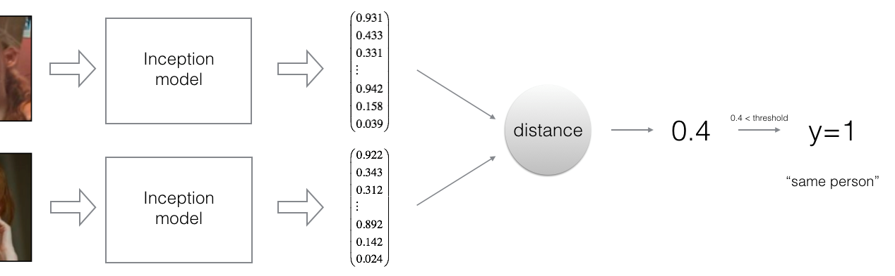

# Data Science Portfolio - Murat Koçak
This Portfolio is a compilation of all the Data Science and Machine Learning projects I have done for learning. It also contains my skills and certificates and is being updated on the regular basis.

- **Email:** deregenboog.m@gmail.com
- **LinkedIn:** [linkedin.com/in/murat-kocak-3b9938195](https://www.linkedin.com/in/murat-kocak-3b9938195/)
- **Published studies:** [independentresearcher.academia.edu/MuratKocak](https://independentresearcher.academia.edu/MuratKocak)

## Projects
 **[COVID-19 Monitoring Project-Part II: Automatic Web-Scraping And Text Summarization -Capstone group project](https://github.com/deregenboogm/NLP_coronavirus_project)**

In partial fulfillment of the requirements for the graduation of Data Science & Machine Learning Course, I have completed the part II of the project and created an automatic web-scraping and text summarization tool through using Natural Language Processing(NLP) techniques, the Python Programming language and related libraries. The tool collects and processes some official reports and statements about COVID-19 from publicly available sources and summarizes them. In addition, it gives summaries of news provided by news web-sites and automatically and daily updates all these outputs. The goal of the tool is to provide advice for public and enable them to easily follow news and important issues around the pandemic (for the whole project, see [humanitariandata.co](https://humanitariandata.co/))
#
 **[Art Generation with Neural Style Transfer - Course assignment](https://github.com/deregenboogm/Building_Convolutional_Neural_Networks/blob/master/Art_Generation_with_Neural_Style_Transfe.ipynb)**

I have learned about Neural Style Transfer(NST) and implemented the NST algoritm; and the algoritm has generated a novel artistic image of the Louvre museum in Paris in the style of a painting by Claude Monet. The algoritm uses a previously trained convolutional network, namely a 19-layer version of the VGG network which was originally developed by [Gatys and others (2015)](https://arxiv.org/pdf/1508.06576.pdf). The VGG network model has already been trained on the very large ImageNet database, and thus has learned to recognize a variety of low level features (at the shallower layers) and high level features (at the deeper layers). So, the algoritm of this project has successfully transferred this learning for the puropose of this project.
#
 **[Car Detection for Autonomous Driving Application - Course assignment](https://github.com/deregenboogm/Building_Convolutional_Neural_Networks/blob/master/Autonomous_driving_application_Car_detection.ipynb)**

I have learned the You Only Look Once-YOLO model and apply it to car detection on a car detection dataset. Because the YOLO model is very computationally expensive to train, the project uses pre-trained weights. YOLO is a popular algorithm with its high accuracy and being able to run in real-time as it requires only one forward propagation pass through the network to make predictions. 
#
 **[Face Verification & Face Recognition - Course assignment](https://github.com/deregenboogm/Building_Convolutional_Neural_Networks/blob/master/Face_Recognition.ipynb)**

I have implemented the triplet loss function, using a pretrained model to map face images into 128-dimensional encodings and using these encodings to perform face verification and recognition tasks. Face Verification is used in applications to verify the identity of a specific person, e.g., face-verification security-systems of smart phones, while Face Recognition can tell who this person is through searching databases. 
#
## Certificates
- **[Data Science & Machine Learning - Deeplo AI](https://www.deeploai.com/)**
- **[Deep Learning Specialization - Coursera](https://www.coursera.org/account/accomplishments/specialization/LYBC2CT82XHX)**
    - **[Structuring Machine Learning Projects](https://www.coursera.org/account/accomplishments/verify/H7YF3Y4SCGXD)**
    - **[Convolutional Neural Networks](https://www.coursera.org/account/accomplishments/verify/SPT2V28H3WHH)**
    - **[Sequence Models](https://www.coursera.org/account/accomplishments/verify/2HKPQDG75Y3B)**
    - **[Improving Deep Neural Networks: Hyperparameter tuning, Regularization and Optimization](https://www.coursera.org/account/accomplishments/verify/V3H64EVGGMMQ)**
    - **[Neural Networks and Deep Learning](https://www.coursera.org/account/accomplishments/verify/9X6TCJQN2TK5)**
- **[Fitting Statistical Models to Data with Python - Coursera](https://www.coursera.org/account/accomplishments/verify/YWZM6PRRCXQ4)**
- **[Using Databases with Python - Coursera](https://www.coursera.org/account/accomplishments/verify/48KHKNJ8CNTW)**
- **[SQL for Data Science - Coursera](https://www.coursera.org/account/accomplishments/verify/RCS4MAWPR3KC)**
- **[Excel Skills for Business: Essentials - Coursera](https://www.coursera.org/account/accomplishments/verify/XLKY7NR5MHNR)**

  
