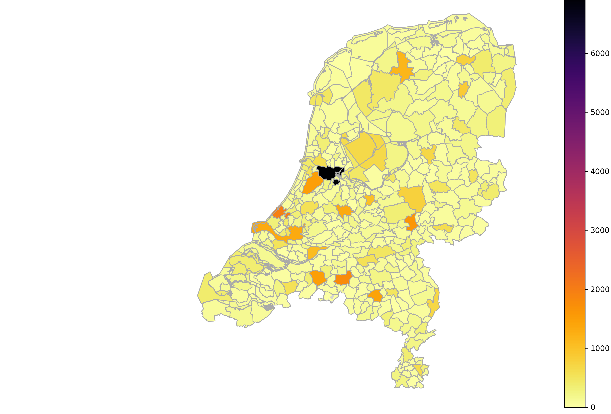

# Murat Koçak
# Data Science and Analytics Portfolio
This Portfolio is a compilation of the Data Science and Analytics projects I have done for learning. It also contains my core competencies and certificates and is being updated on regular basis.

- **Email:** muratko357@gmail.com
- **LinkedIn:** [linkedin.com/in/muratko357](https://www.linkedin.com/in/muratko357/)

## Projects

 **[Creating a Dashboard with Python: Airline Flights Performance](https://github.com/muratko357/dash_application/blob/main/US_Domestic_Airline_Flights_Performance.py)** 

_Tools: Python, pandas, plotly, dash_

I developed an interactive, web-based dashboard application that visualizes the performance of US domestic airlines in real time.
                                                                                                                                                                                       
       
 **[Weather Prediction](https://github.com/muratko357/Weather-prediction/blob/main/Weather%20prediction.ipynb)** 

_Tools: Python, numpy, pandas, matplotlib, seaborn, scipy, sklearn, time_

I built a machine-learning classification model to predict whether it will rain tomorrow using Australian weather data. I evaluated various models, including Logistic Regression, Decision Tree, Random Forest, and Support Vector Machine, to determine the best fit based on accuracy and computation time.	
 

**[LendingClub Data Analysis: Predicting Payments](https://github.com/muratko357/ML_models/blob/master/Decision_Tree_and_Random-Forests_Project.ipynb)**

_Tools: Python, numpy, pandas, matplotlib, seaborn, sklearn_

I performed an exploratory data analysis on LendingClub loan data using data visualization techniques. Then, I applied Random Forest and Decision Tree models to predict loan repayment outcomes, considering variables such as loan purpose, interest rate, monthly installments, borrower income, debt-to-income ratio, FICO score, and credit line age.

**[Bank Note Authentication](https://github.com/muratko357/ML_models/blob/master/banknote-authentication.ipynb)**

_Tools: Python, pandas, matplotlib, seaborn, sklearn, tensorflow_

Using the UCI Bank Authentication Data Set, I employed a Deep Neural Network Classifier to predict the authenticity of bank notes. The dataset includes features such as the variance, skewness, kurtosis, and entropy of Wavelet Transformed images. 
 

 **[Uber Data Analysis](https://github.com/muratko357/Uber-data-analysis)**

_Tools: Python, numpy, pandas, matplotlib, seaborn_

I analyzed Uber pickup data from April 2014 in New York using data visualization and crosstabulation techniques. The analysis provides insights for business and drivers based on the geographic location and timing of the calls.
 

**[Superstore Dataset Analysis: Sales, Profits, and Shipment](https://public.tableau.com/profile/murat.kocak#!/)**

_Tools: Tableau_

I created various dashboards to answer business questions related to sales, profits, and shipment statuses of orders, applying design principles of data visualization.
 

 **[Analysis of the Dataset for California Electoral Politics](https://arcg.is/vOr9v)**

_Tools: ArcGIS_

I analyzed the 2012 electoral data for California, which includes geographic information and vote counts for GMOs in food. I created a map displaying the normalized distribution of 'yes' votes by county. The PDF format of the map’s layout can be seen (**[here](https://github.com/muratko357/muratko357.github.io/blob/main/Images/California%20electoral%20politics%202012.pdf)**) and the map package is shared on my ArcGIS account **[here](https://arcg.is/vOr9v)**.
 

 **[Analysis of Violent and Sexual Crime in the Netherlands 2018](https://github.com/muratko357/Netherlands-Crime-Analysis)**

_Tools: Python, numpy, pandas, geopandas, matplotlib, json, bokeh, & Tableau_

I conducted exploratory analyses on violent and sexual crimes across Dutch municipalities and Amsterdam neighborhoods. Using Python libraries, I created static and interactive choropleths and further analyzed the data with Tableau for better visualization outputs (see the [dashboards](https://public.tableau.com/views/Netherlandscrimerateofviolentandsexualcrimebymunicipality/ViolentandSexualCrimeinNetherlands2018?:language=en-US&:display_count=n&:origin=viz_share_link)
 

 **[San Francisco Crime Data Analysis](https://github.com/muratko357/San-Francisco-Crime-Data-Analysis)**

_Tools: Python, pandas, matplotlib, seaborn, folium_

I performed an exploratory data analysis on San Francisco's 2016 crime dataset using visualization tools, crosstabulation, and crime mapping to display crime rates across city districts.    
 

 **[COVID-19 Group Project-Part II: Creating an Automatic Web-Scraping and Text Summarization Tool](https://github.com/muratko357/NLP_coronavirus_project)**

_Tools: Python, pandas, BeautifulSoup, nltk, re, threading, time_

For my Data Science & Machine Learning course, I created an automatic web-scraping and text summarization tool using Natural Language Processing (NLP). This tool collects and processes official COVID-19 reports and media summaries to help the public easily follow official advice and news.
 

 **[Art Generation with Neural Style Transfer](https://github.com/muratko357/Building_Convolutional_Neural_Networks/blob/master/Art_Generation_with_Neural_Style_Transfe.ipynb)**

_Tools: Python, numpy, pandas, os, sys, scipy, imageio, matplotlib, tersorflow, pprint_

I implemented the Neural Style Transfer (NST) algorithm to generate an artistic image of the Louvre museum in Paris in the style of a Claude Monet painting. The algorithm uses a pre-trained 19-layer VGG network model.
 

 **[Car Detection for Autonomous Driving Application](https://github.com/muratko357/Building_Convolutional_Neural_Networks/blob/master/Autonomous_driving_application_Car_detection.ipynb)**

_Tools: Python, numpy, argparse, os, matplotlib, scipy, PIL, tensorflow, keras, yolo utilities provided by deeplearning.ai_

I applied the You Only Look Once (YOLO) model for car detection using a pre-trained dataset. YOLO is known for its high accuracy and real-time processing capabilities.
 

 **[Face Verification & Face Recognition](https://github.com/muratko357/Building_Convolutional_Neural_Networks/blob/master/Face_Recognition.ipynb)**

_Tools: Python, numpy, pandas, keras, tensorflow, cv2, os, utilities provided by deeplearning.ai_ 

I implemented the triplet loss function using a pretrained model to map face images into 128-dimensional encodings for face verification and recognition tasks. Face Verification is used for identity verification in applications like smartphone security systems, while Face Recognition identifies individuals by searching databases.
 

## Areas of expertise
*	Research methods
*	Data analytics
*	Crime analysis
*	Developing policies for safety and crime prevention

## Areas of experience

*	Machine Learning
*	Deep Learning
*	GIS mapping
   
## Software
SQL, Python, R, Pandas, Numpy, SciPy, Matplotlib, Seaborn, Plotly, Scikit_learn, Statsmodels, Excel, Power BI, Tableau, IBM Watson Studio, R-Studio, IBM Cognos, ArcGIS, MS Suit, Google Suit, Jupyter Notebook, HTML & CSS, and Stata

## Certified Courses

- **[Google Business Intelligence Professional Certificate]([https://www.coursera.org/account/accomplishments/specialization/certificate/QDFLN35MYTKP](https://coursera.org/share/68a5c34ecfa2aa9aa0eb1804e7a08b5a))**
    
    _Authorized by Google_  
    _Issued by Coursera, 14 June 2024_  
    
Completed an intensive three-course program (Foundations of BI, Data Models and Pipelines, Dashboards & Reports) designed for entry-level Business Intelligence roles. Through hands-on projects and practical assessments, I mastered the creation of processes that transform raw data into actionable insights for strategic business decisions. Key achievements include:

*	Developing a comprehensive BI project plan.
*	Constructing data pipelines and applying ETL processes with Google DataFlow and BigQuery to achieve organizational goals.
*	Utilizing BI reporting and dashboard tools to effectively communicate data insights to stakeholders.

- **[IBM Data Analyst Professional Certificate](https://www.coursera.org/account/accomplishments/specialization/certificate/QDFLN35MYTKP)**
    
    _Authorized by IBM_  
    _Issued by Coursera, 30 October 2021_  
    This IBM Professional Certificate was earned after successfully completing 9 courses on various topics in Data Analytics. The courses included hands-on work with various data sources, project scenarios, and data analysis tools, including Excel, SQL, Relational Databases, Python, Jupyter Notebooks, and Cognos Analytics. I gained practical experience with data manipulation, data analysis, and data visualization. I demonstrated proficiency in applying different analytical techniques by analyzing real-world datasets, creating visualizations & interactive dashboards, and presenting reports to share findings of data analysis. This certificate equips me with skills for an entry-level role in data analytics.
      
- **[Deep Learning Specialization](https://www.coursera.org/account/accomplishments/specialization/certificate/LYBC2CT82XHX)**

    _Authorized by DeepLearning.AI_  
    _Issued by Coursera, 12 March 2020_  
    This certificate was earned after successfully completing 5 courses. The courses covered neural network architectures, such as Convolutional Neural Networks, Recurrent Neural Networks, LSTMs, Transformers, and strategies to improve them, such as Dropout, BatchNorm, and Xavier/He initialization. The courses also included their theoretical concepts, industry applications using Python and TensorFlow in real-world cases such as speech recognition, music synthesis, chatbots, machine translation, and natural language processing.
      
- **[Data Science & Machine Learning](https://www.deeploai.com/)**
    
    _Issued by DeeploAI, 15 July 2020_  
    This 10-month course, including a capstone project, covered Python for Data Science, Databases and SQL, Linear Algebra, Statistics, GIT, data pre-processing, Regression, Classification, Machine Learning Models, TensorFlow, and Keras, and more.  
           
**_Other courses:_**

- **[Data Analysis with R Programming](https://www.coursera.org/account/accomplishments/certificate/EM9XKD8KLAHU)**

    _Authorized by Global Director of Google Career Certicates_  
    _Issued by Coursera, 10 July 2022_    
    
- **[Fundamentals of GIS](https://www.coursera.org/account/accomplishments/certificate/W2JTUKMBJPEP)**
  
    _Authorized by University of California, Davis_  
    _Issued by Coursera, 22 March 2021_    
- **[Essential Design Principles for Tableau](https://www.coursera.org/account/accomplishments/certificate/Z44V2B8MTPBN)**
        
    _Authorized by University of California, Davis_  
    _Issued by Coursera, 22 January 2021_  
- **[Excel Skills for Business: Essentials](https://www.coursera.org/account/accomplishments/certificate/XLKY7NR5MHNR)**

    _Authorized by Macquarie University_  
    _Issued by Coursera, 17 February 2020_ 
- **[Fitting Statistical Models to Data with Python](https://www.coursera.org/account/accomplishments/certificate/YWZM6PRRCXQ4)**
    
    _Authorized by University of Michigan_  
    _Issued by Coursera, 7 February 2020_ 
- **[Using Databases with Python](https://www.coursera.org/account/accomplishments/certificate/48KHKNJ8CNTW)**

    _Authorized by University of Michigan_  
    _Issued by Coursera, 30 October 2019_    
- **[SQL for Data Science](https://www.coursera.org/account/accomplishments/certificate/RCS4MAWPR3KC)**
    
    _Authorized by University of California, Davis_  
    _Issued by Coursera, 28 October 2019_
