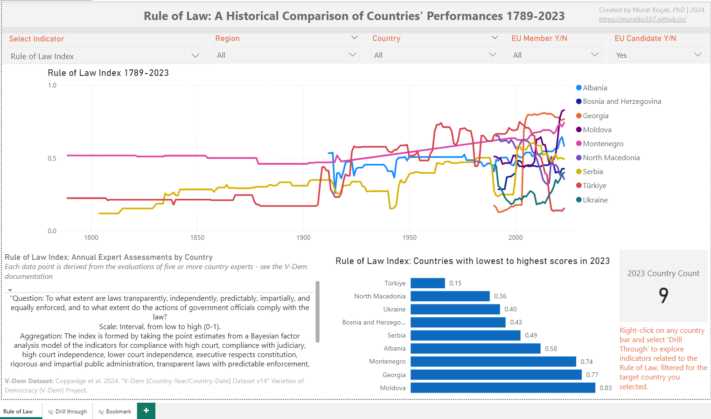
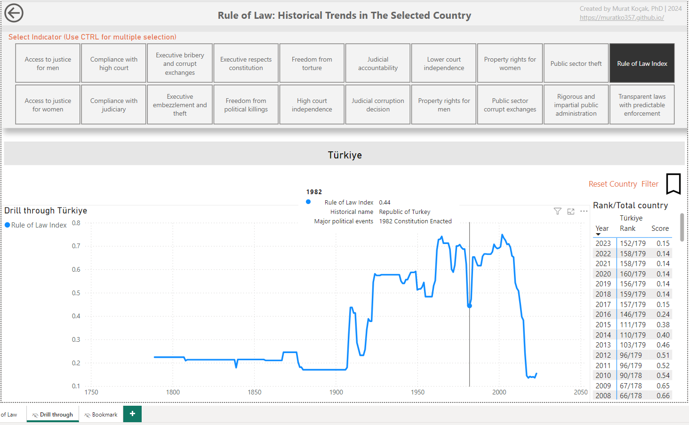

# Welcome to My Data Science and Analytics Portfolio
This professional portfolio showcases a diverse range of Data Science and Analytics projects that I have undertaken for academic purposes, personal development, and professional training. Here, you will find detailed case studies of my work, reflections on what I've learned, and documentation of my core competencies along with certifications that validate my expertise.

Feel free to contact me for collaboration or further discussion:
- **Email:** muratko357@gmail.com
- **LinkedIn:** [linkedin.com/in/muratko357](https://www.linkedin.com/in/muratko357/)

---
## Areas of expertise
- Research Methods and Statistics in Social Sciences
- Data Analysis and Visualization
- Business Intelligence (BI) and Dashboarding
- Security Risk and Threat Analysis
- Theoretical Foundations and Practical Applications of Crime Prevention Techniques
- Improving Safety and Security Measures

---
## Projects
### 1. Data Analysis and Business Intelligence (BI) Projects
 
#### [1.1. Mapping and Analyzing Security Incidents to Enhance the Safety of Humanitarian Aid Workers in High-Risk Areas:](https://github.com/muratko357/Aid-worker-security-incidents-analysis)

_Tools: Power BI, DAX, M, Python, GeoPy, Pandas, QGIS, Mapshaper_

This project aims to enhance the safety of humanitarian aid workers by analyzing security incidents in which they were killed, wounded, or kidnapped from 1997 to 2024. Deliverables include a two-page interactive Power BI dashboard and a complementary QGIS map visualization (PNG). These tools provide actionable insights into incident patterns, victim demographics, organizational involvement, and geographic hotspots. By integrating advanced data modeling, geospatial analysis, and dynamic visualizations, the project empowers security managers, analysts, and humanitarian organizations to make informed strategic and operational decisions in high-risk areas.

#### _1.1.1. Key Features_

**a) Interactive Power BI Dashboard**
 
**Global Overview (1997–2024):** A dynamic visualization showcasing global trends in security incidents. This page uses bubble maps to plot incident locations by latitude and longitude, where bubble size and color represent the severity of victim counts (aid workers). Users can interactively filter incidents by year, organization, casualty type, and demographic variables to gain a high-level understanding of patterns worldwide.

**East Mediterranean Humanitarian Corridor (2012–2024):** A detailed analysis of provincial-level incidents within the East Mediterranean region (Israel, Palestine, Lebanon, and Syria). This page leverages custom shape maps, enriched with victim count data at the province level. Interactive slicers provide insights tailored to specific humanitarian organizations and casualty types, enabling decision-makers to focus on regional challenges.
  
 
 

 

 

**b) Custom QGIS Map Visualization**
 
The custom QGIS map visualization for the East Mediterranean Humanitarian Corridor uses data points derived from latitude and longitude to map incidents at the provincial level. Attack types are symbolized for clarity, while labels highlight functional locations impacted by incidents, such as office, organization compound, and project site. The map’s layers were standardized and aligned for accurate analysis and layout.

 

#### _1.1.2. Data Sources and Preparation_

**a) Primary Dataset:**
Aid Worker Security Incident-level Data from 1997–2024, including victim demographics, casualty types, and organizational affiliations. Source: Aid Worker Security Database.

**b) Geographic Data:**
Shapefiles for Israel, Palestine, Lebanon, and Syria downloaded from GADM, standardized using QGIS, and converted to TopoJSON for seamless Power BI integration.

**c) Data Cleaning and Transformation:**
 
**Python for Reverse Geocoding:** Missing geographic details were imputed using latitude and longitude.
 
**Power Query for Standardization:** Adjusted geographic names (e.g., "Deir ez-Zor" → "Dayr Az Zawr") and addressed inconsistencies across datasets.

#### _1.1.3. Technical Highlights_

**a) Advanced Power BI Features:**
 
**Dynamic Measure - Victim Count:** Calculates the total number of victims, dynamically adjusting based on slicer selections such as date, country, attack type, casualty type, organization, functional location, gender, and more.
 
**Dynamic Measure - Incident Count:** Calculates the total number of distinct incidents similarly.
 
**Dynamic Map Titles:** Titles adapt based on slicer selections for contextual relevance.
 
**Custom Shape Maps:** Merged shapefiles enriched Power BI visuals with region-specific insights.

**b) Relationships and Filtering Logic:**
 
**Bridge Table:** Addressed many-to-many relationships between organizations and casualty types for accurate cross-filtering.
 
**Temporal Filtering:** Calendar table enables trends by year, month, and week.

**c) Geospatial Integration:**
 
**QGIS and MapShaper:** Custom province-level maps required shapefile standardization and projection alignment (EPSG:4326).
 
**Interactive Power BI Maps:** Bubble maps for global and regional analyses are responsive to user-selected filters.

#### _1.1.4. Impact and Future Enhancements_ 
This project enables humanitarian actors to enhance resource allocation, risk assessment, and policy development by leveraging data analytics and GIS.

Future Plans: Introduce filters for Actor Type (primary instigator group responsible for the event) and Motive to deepen insights. Optimize DAX measures and integrate real-time data for enhanced responsiveness.

_Note: The data points indicating incident locations are approximate rather than exact, due to the imputation of missing values in the latitude and longitude columns._

📂 Explore the [repository](https://github.com/muratko357/Aid-worker-security-incidents-analysis) for QGIS map, Power Query M code, DAX measures, and Python scripts.

📊 Download the Dashboard, the Power BI file is accessible [here](https://github.com/muratko357/Aid-worker-security-incidents-analysis/blob/main/Dashboard%20aid%20worker%20security%2020241122.pbix).

---
 
#### [1.2. Rule of Law Dashboard: A Historical Comparison of Countries' Performances 1789-2023:](https://github.com/muratko357/Rule_of_Law_Dashboard))

_Tools: Power BI, DAX_

This interactive Power BI dashboard leverages the V-Dem Dataset (Varieties of Democracy) to analyze the Rule of Law Index and related indicators from 1789 to 2023 across countries worldwide. By integrating advanced DAX calculations, it dynamically explores historical trends in judicial independence, access to justice, transparent laws with predictable enforcement, and more. Offering perspectives on governance evolutions at regional and national levels, this tool equips researchers, policymakers, and security analysts with actionable insights into institutional resilience, societal stability, and democratic progress.

 
 
 
<small style="color:gray; font-size: 0.8em;"><em>Screenshots: Main and Drill through pages</em></small>
 

#### Historical Trends Analysis:
Visualizes the evolution of governance indicators, such as access to justice and judicial independence, enabling users to track trends over centuries. EU expansion is highlighted with dynamically updated information as users hover over specific years.

#### Dynamic Indicator Calculations:
The dashboard employs advanced DAX formulas to allow users to select indicators and dynamically update the visualizations, providing indicator-specific insights tailored to user preferences.

#### Country Comparisons:
Users can select individual countries or regions, such as Europe or EU candidates, to compare rule of law performance. A bar chart ranks countries based on their most recent scores, offering a quick visual comparison across selected nations.

#### Country-Specific Ranking and Score Analysis:
On drill-through pages, users can view each selected country’s historical name, historical score, and ranking for each Rule of Law indicator by year, enabling detailed, year-over-year comparisons within a global context.

#### Interactive Tooltips and Descriptions:
Tooltips and dynamic text boxes provide definitions and detailed explanations for each indicator, alongside contextual information from the dataset codebook and relevant academic references.

#### Impact:
The Rule of Law Dashboard enables dynamic comparisons across countries and regions, revealing historical and contemporary trends that inform discussions on security, institutional integrity, and democratic resilience. The tool supports informed decision-making, fosters regional understanding, and highlights the rule of law's critical role in advancing democratic governance and societal stability.

📂 Explore the [repository](https://github.com/muratko357/Rule_of_Law_Dashboard) for additional information and DAX measures.

📊 Download the Dashboard, the Power BI file is accessible [here](https://github.com/muratko357/Rule_of_Law_Dashboard/blob/main/Rule_of_Law_Dashboard-Compare_Countries_1789-2023.pbix)

---

#### [1.3. Inventory Management Dashboard:](inventory_management_dashboard.pbix)

 

_Tools: Power BI, DAX_

This Inventory Management Dashboard enables data-driven decision making to enhance supply chain efficiency, showcasing advanced Power BI visualizations and DAX formulas. Key features include:

##### ABC and XYZ Analysis:
The dashboard segments products by their revenue contribution (ABC classification) and demand consistency (XYZ classification), allowing businesses to focus on high-priority items with reliable or unpredictable demand patterns.

##### Reorder Optimization:
Using dynamic calculations, the dashboard identifies when stock should be replenished based on historical sales data, lead times, and supplier delivery intervals. This helps maintain optimal stock levels, reducing both excess inventory and stockouts.

##### Inventory Turnover Insights:
The Inventory Turnover Ratio helps monitor the frequency with which inventory is sold and replenished, providing critical data to improve stock movement and overall supply chain performance.

##### Sales and Demand Trends:
By analyzing historical sales trends, the dashboard supports better forecasting and inventory planning, ensuring that stock levels are aligned with actual market demand. 

A downloadable version of the Power BI file is accessible [here](inventory_management_dashboard.pbix).

---

#### [1.4. Minnesota Interstate Traffic Volume Analysis:](https://public.tableau.com/views/GoogleBusinessIntelligenceCarrierCertificateMinnesotaTrafficVolume/Minnesota?:language=en-US&:sid=&:display_count=n&:origin=viz_share_link)

 

_Tools: Google Cloud, Google DataFlow, Google BigQuery, Tableau_

As the capstone project for the Google Business Intelligence Professional Certificate, this analysis showcases my expertise in building BI solutions, data pipelines, and interactive visualizations. The project involved developing a detailed BI project plan, constructing a data pipeline via Google DataFlow to transport data to BigQuery, and creating a Tableau dashboard that visualizes Minnesota interstate traffic volume. The dashboard also explores the effects of weather, holidays, and time of day on traffic patterns, providing insights into the best times for road maintenance and construction. [View Dashboard](https://public.tableau.com/views/GoogleBusinessIntelligenceCarrierCertificateMinnesotaTrafficVolume/Minnesota?:language=en-US&:sid=&:display_count=n&:origin=viz_share_link)

---

#### [1.5. Creating a Dashboard with Python: Airline Flights Performance:](https://github.com/muratko357/dash_application/blob/main/US_Domestic_Airline_Flights_Performance.py)

_Tools: Python, pandas, plotly, dash_

I developed an interactive, web-based dashboard to analyze and visualize the performance of US domestic airlines. Leveraging Python's robust libraries—pandas for data manipulation, Plotly for creating interactive visualizations, and Dash as the web framework—the application provides an in-depth analysis of key performance metrics, including flight cancellations, average airtime, and delays categorized by type.

The dashboard features dynamic filtering by year and report type, enabling users to extract tailored insights and explore trends impacting airline operations. For more details, view the [Python application.](https://github.com/muratko357/dash_application/blob/main/US_Domestic_Airline_Flights_Performance.py).

---

#### [1.6. Uber Data Analysis:](https://github.com/muratko357/Uber-data-analysis)

 

_Tools: Python, numpy, pandas, matplotlib, seaborn_

I conducted an in-depth analysis of Uber pickup data from April 2014 in New York City, employing data visualization and crosstabulation techniques to uncover key trends. The analysis highlights insights for both Uber's business strategy and driver operations, focusing on geographic patterns and the timing of ride requests.

For more details, view the project [documentation.](https://github.com/muratko357/Uber-data-analysis).

---

#### [1.7. Analysis of the Dataset for California Electoral Politics:](https://arcg.is/vOr9v)

 

_Tools: ArcGIS_

I analyzed California's 2012 electoral data, focusing on geographic patterns and vote distributions for a ballot proposition related to GMOs in food. Using ArcGIS, I created a map that visualizes the normalized distribution of "yes" votes across counties, offering insights into voter behavior and regional trends.

View the map layout in PDF format [here](https://github.com/muratko357/muratko357.github.io/blob/main/Images/California%20electoral%20politics%202012.pdf) or explore the complete map package on my ArcGIS account [here.](https://arcg.is/vOr9v)

---

#### [1.8. San Francisco Crime Data Analysis:](https://github.com/muratko357/San-Francisco-Crime-Data-Analysis)

 

_Tools: Python, pandas, matplotlib, seaborn, folium_

I conducted an exploratory analysis of San Francisco's 2016 crime dataset, which includes incidents across all categories recorded by the police department. This analysis employs data visualization techniques, crosstabulation, and a thematic map to examine crime distribution across the city’s districts.

Key findings reveal that Larceny/Theft was the city's most pressing issue, with the Southern district reporting the highest total number of crimes, including those related to Larceny/Theft. Furthermore, one specific neighborhood exhibited the highest overall crime registry, clearly illustrated in the analysis.

The analysis also highlights temporal patterns in criminal activity. Fridays emerged as the most active day for crimes, while Sundays were the least active. The data further reveals how crime distribution fluctuates throughout the day

For more details, view the project [documentation.](https://github.com/muratko357/San-Francisco-Crime-Data-Analysis)

---

### 2. Machine Learning and Deep Learning Projects

#### [2.1. Weather Prediction:](https://github.com/muratko357/Weather-prediction/blob/main/Weather%20prediction.ipynb)

 

_Tools: Python, NumPy, pandas, matplotlib, seaborn, SciPy, scikit-learn, time_

As part of a course exercise, I implemented a machine learning classification model to predict whether it will rain tomorrow, using Australian weather data. I explored various models, including Logistic Regression, Decision Tree, Random Forest, and Support Vector Machine, comparing their performance based on accuracy and computational efficiency.

The DecisionTreeClassifier was identified as the most suitable model, striking a balance between accuracy and computation time.

For more details, view the [Python script.](https://github.com/muratko357/Weather-prediction/blob/main/Weather%20prediction.ipynb)

---

#### [2.2. LendingClub Data Analysis: Predicting Payments:](https://github.com/muratko357/ML_models/blob/master/Decision_Tree_and_Random-Forests_Project.ipynb)

 

_Tools: Python, numpy, pandas, matplotlib, seaborn, sklearn_

As part of a course exercise, I conducted an exploratory data analysis on LendingClub loan data using data visualization techniques. Following the analysis, I implemented Random Forest and Decision Tree models to predict loan repayment outcomes. The model incorporated features such as loan purpose, interest rate, monthly installments, borrower income, debt-to-income ratio, FICO score, and credit line age.

For more details, view the [Python script.](https://github.com/muratko357/ML_models/blob/master/Decision_Tree_and_Random-Forests_Project.ipynb)

---

#### [2.3. Bank Note Authentication:](https://github.com/muratko357/ML_models/blob/master/banknote-authentication.ipynb)

 

_Tools: Python, pandas, matplotlib, seaborn, sklearn, tensorflow_

As part of a course exercise, I worked with the UCI Bank Authentication Data Set to predict the authenticity of bank notes. Using a Deep Neural Network Classifier, I analyzed features such as the variance, skewness, kurtosis, and entropy of Wavelet Transformed images to build a predictive model.

For more details, view the [Python script](https://github.com/muratko357/ML_models/blob/master/banknote-authentication.ipynb).     

---

#### [2.4. Art Generation with Neural Style Transfer:](https://github.com/muratko357/Building_Convolutional_Neural_Networks/blob/master/Art_Generation_with_Neural_Style_Transfe.ipynb)

 

_Tools: Python, numpy, pandas, os, sys, scipy, imageio, matplotlib, tersorflow, pprint_

As part of a course exercise, I implemented the Neural Style Transfer (NST) algorithm to generate an artistic rendition of the Louvre museum in Paris styled after a Claude Monet painting. The algorithm utilizes a pre-trained 19-layer VGG network model, leveraging its ability to separate content and style features from images to produce the final output.

For more details, view the [Python script.](https://github.com/muratko357/Building_Convolutional_Neural_Networks/blob/master/Art_Generation_with_Neural_Style_Transfe.ipynb)

---

#### [2.5. Car Detection for Autonomous Driving Application:](https://github.com/muratko357/Building_Convolutional_Neural_Networks/blob/master/Autonomous_driving_application_Car_detection.ipynb)

 

_Tools: Python, numpy, argparse, os, matplotlib, scipy, PIL, tensorflow, keras, yolo utilities provided by deeplearning.ai_

As part of a course exercise, I applied the You Only Look Once (YOLO) model for car detection using a pre-trained dataset. YOLO is renowned for its high accuracy and real-time processing capabilities, making it an ideal choice for applications in autonomous driving. The implementation focused on identifying vehicles within images efficiently and accurately.

For more details, view the [Python script.](https://github.com/muratko357/Building_Convolutional_Neural_Networks/blob/master/Autonomous_driving_application_Car_detection.ipynb)

---

#### [2.6. Face Verification & Face Recognition:](https://github.com/muratko357/Building_Convolutional_Neural_Networks/blob/master/Face_Recognition.ipynb)

 

_Tools: Python, numpy, pandas, keras, tensorflow, cv2, os, utilities provided by deeplearning.ai_ 

As part of a course exercise, I implemented the triplet loss function using a pre-trained model to map face images into 128-dimensional encodings for face verification and recognition tasks.

**Face Verification:** Verifies a person's identity, commonly used in applications like smartphone security systems.

**Face Recognition:** Identifies individuals by searching against a database of face encodings.

This project showcased the application of deep learning techniques in building models for both identity verification and recognition tasks.

For more details, view the [Python script.](https://github.com/muratko357/Building_Convolutional_Neural_Networks/blob/master/Face_Recognition.ipynb)

---
### 3. Web-scraping and NLP Projects

#### [COVID-19 Group Project-Part II: Creating an Automatic Web-Scraping and Text Summarization Tool:](https://github.com/muratko357/NLP_coronavirus_project)

 

_Tools: Python, pandas, BeautifulSoup, nltk, re, threading, time_

As part of a group project for my Data Science & Machine Learning course, I developed an automatic web-scraping and text summarization tool leveraging Natural Language Processing (NLP) techniques. The tool collects and processes official COVID-19 reports and media summaries, making it easier for the public to stay updated on official advice and news.

For more details, view the project [repository.](https://github.com/muratko357/NLP_coronavirus_project)

----

## Certified Courses

**[Google Business Intelligence Professional Certificate](https://coursera.org/share/68a5c34ecfa2aa9aa0eb1804e7a08b5a)**
    
_Authorized by Google_  
_Issued by Coursera, 14 June 2024_  
    
In this intensive three-course program, I gained the skills necessary for entry-level Business Intelligence roles. While I already possessed most of these skills, I enrolled in the program to earn the certificate and gain deeper insights into BI industry applications. Throughout the course, I worked with tools such as Google Cloud, Google DataFlow, Google BigQuery, SQL, and Tableau.

**[IBM Data Analyst Professional Certificate](https://www.coursera.org/account/accomplishments/specialization/certificate/QDFLN35MYTKP)**
    
_Authorized by IBM_  
_Issued by Coursera, 30 October 2021_  
    
This IBM Professional Certificate was earned after successfully completing 9 courses on various topics in Data Analytics. The courses included hands-on work with various data sources, project scenarios, and data analysis tools, including Excel, SQL, Relational Databases, Python, Jupyter Notebooks, and Cognos Analytics. I gained practical experience with data manipulation, data analysis, and data visualization. I demonstrated proficiency in applying different analytical techniques by analyzing real-world datasets, creating visualizations & interactive dashboards, and presenting reports to share findings of data analysis. This certificate equips me with skills for an entry-level role in data analytics.
      
**[Deep Learning Specialization](https://www.coursera.org/account/accomplishments/specialization/certificate/LYBC2CT82XHX)**

_Authorized by DeepLearning.AI_  
_Issued by Coursera, 12 March 2020_  
    
This certificate was earned after successfully completing 5 courses. The courses covered neural network architectures, such as Convolutional Neural Networks, Recurrent Neural Networks, LSTMs, Transformers, and strategies to improve them, such as Dropout, BatchNorm, and Xavier/He initialization. The courses also included their theoretical concepts, industry applications using Python and TensorFlow in real-world cases such as speech recognition, music synthesis, chatbots, machine translation, and natural language processing.
      
**[Data Science & Machine Learning](https://www.deeploai.com/)**
    
_Issued by DeeploAI, 15 July 2020_  
    
This 10-month course, including a capstone project, covered Python for Data Science, Databases and SQL, Linear Algebra, Statistics, GIT, data pre-processing, Regression, Classification, Machine Learning Models, TensorFlow, Keras, and more.  
           
**[Data Analysis with R Programming](https://www.coursera.org/account/accomplishments/certificate/EM9XKD8KLAHU)**

_Authorized by Global Director of Google Career Certicates_  
_Issued by Coursera, 10 July 2022_  

**[Fundamentals of GIS](https://www.coursera.org/account/accomplishments/certificate/W2JTUKMBJPEP)**
  
_Authorized by University of California, Davis_  
_Issued by Coursera, 22 March 2021_  

**[Essential Design Principles for Tableau](https://www.coursera.org/account/accomplishments/certificate/Z44V2B8MTPBN)**
        
_Authorized by University of California, Davis_  
_Issued by Coursera, 22 January 2021_ 

**[Excel Skills for Business: Essentials](https://www.coursera.org/account/accomplishments/certificate/XLKY7NR5MHNR)**

_Authorized by Macquarie University_  
_Issued by Coursera, 17 February 2020_  

**[Fitting Statistical Models to Data with Python](https://www.coursera.org/account/accomplishments/certificate/YWZM6PRRCXQ4)**
    
_Authorized by University of Michigan_  
_Issued by Coursera, 7 February 2020_ 

**[Using Databases with Python](https://www.coursera.org/account/accomplishments/certificate/48KHKNJ8CNTW)**

_Authorized by University of Michigan_  
_Issued by Coursera, 30 October 2019_     

**[SQL for Data Science](https://www.coursera.org/account/accomplishments/certificate/RCS4MAWPR3KC)**
    
_Authorized by University of California, Davis_  
_Issued by Coursera, 28 October 2019_ 
